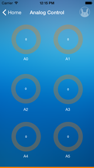

### Tah
We interact with a lot of devices everyday. Almost all of these can be made smarter by bringing a smartphone and TAH together. TAH is a Bluetooth 4.0 enabled development platform that is compatible with the Arduino.
This app allows you to individually control and get data from all the pins of the Tah.

This repository consists of the iOS and Android(coming soon) source code along with the corresponding Arduino sketch for the Tah  app.

 
  
<a href="https://itunes.apple.com/us/app/tah/id909883039?mt=8"></img></a>

---

## Usage

#### Arduino
* Install the
[Tah Arduino Library](https://github.com/tah-io/Tah_Arduino_Library#installing)
* Download the
[ArdSCL](https://raw.githubusercontent.com/tah-io/Tah/master/ArdSCL/ArdSCL.ino)
and open it in the Arduino IDE
* Upload it on your Tah board

#### iOS
* Clone the repo

		git clone https://github.com/tah-io/Tah.git

* Change directory to the appropriate submodule (iOS or Android)

		cd Tah-iOS

* Initialize and update the submodule

		git submodule init
		git submodule update
* Open the Xcode project file TAH.xcodeproj 
